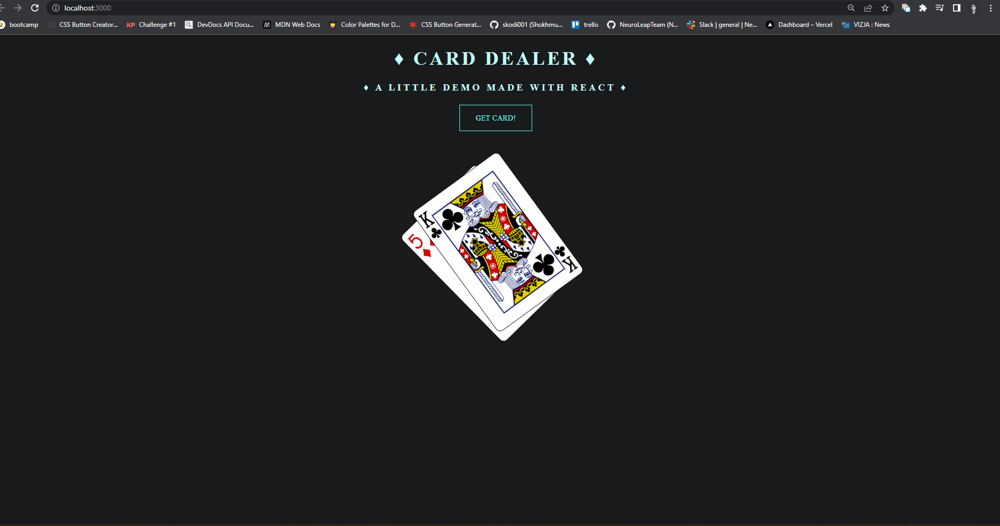

I created CARDS API Project. This is the project where I could tried to ace using "axios" and "state". Paid a special attention to styling as well. Please feel free to take a look at demo below:

[Live Demo](https://cards-api-project.vercel.app/)
